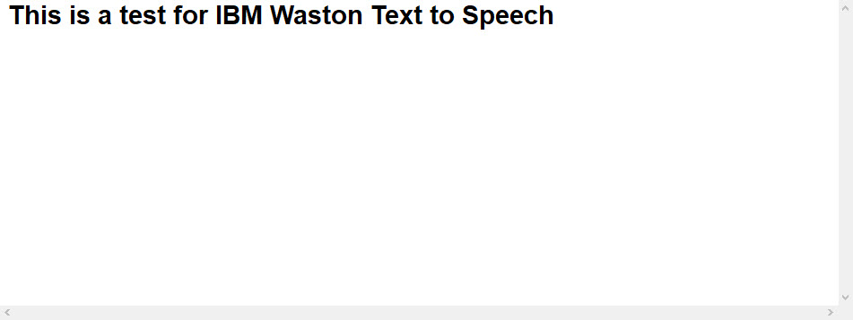

# Python-tts-stt

## المقدمة:

##### المهمه الرابعه عباره عن سبيش تو تكست و تكست تو سبيش عن طريق استخدام لغه البايثون كانت جديده وشوي اصعب من الي قبل بس استخدمنا مصادر معينه ساعدتنا ع انجاز المهمه

## المهام المطلوبة:

<ul>
  <li>استخدام لغه بايثون لانشاء تكست تو سبيش و سبيش تو تكست</li>
  <li>حفظ الاوتبت في ملف خارجي نصي حق التكست.</li>
  <li>حفظ الاوتبت في ملف خارجي مسموع ام بي ثري.</li>

  

</ul>

## طريقة الانشاء:
 
##### اتبعت مصادر معينه سهلت علي كثير الطريقه وكانت شوي صعبه بس الحمدلله اجتزناها استخدمنا لغه بايثون للانشاء مع اتباع المصادر المتوفره والبحث قدرنا نخلي كلامنا يتحول لنص والعكس كذلك كل شي موضح بالصور التوضيحيه ادناه، وجعلنا الاوتبت تنحفط في ملف نصي و ام بي ثري كما هو مطلوب. 

## صور توظيحيه للعمليه:

#### صورة توضيحية.
##### ايضاً فيه ام بي ثري فوق في الملفات اسمه سبيش
  

